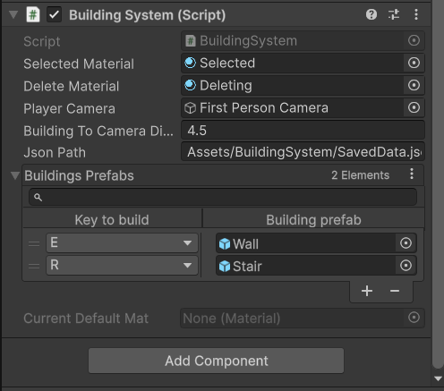

 
 # 🔨 BuildingSystem

Building system for Unity Engine with saving building's data in JSON.

## Features:
- Creating and deleting walls(you can add your own construtcion)
- Unlimited ability to add an unlimited number of construtcio and keys for them in the Inspector.
- Saving building's data(position, rotation and name) in JSON. After loading scene(or game) again you'll see all buildings that you've been built.

---

## Used Assets:

"Serialized Dictionary" asset by [ayellowpaper](https://assetstore.unity.com/publishers/52046)

&nbsp;

"Mini First Person Controller" asset by [Simon Serge Pasi](https://assetstore.unity.com/publishers/38264)

&nbsp;

"Stylized Wood Textures" asset by [Camisado Studios](https://assetstore.unity.com/publishers/55842)

&nbsp;

---

## 📄 License

This project is licensed under the **MIT License**.  
See the [LICENSE](LICENSE) file for full terms.

---

## 👨‍💻 Author

**HardCodeDev**  
- [GitHub](https://github.com/HardCodeDev777)  
- [Itch.io](https://hardcodedev.itch.io/)

---

> 💬 Got feedback, found a bug, or want to contribute? Open an issue or fork the repo on GitHub!